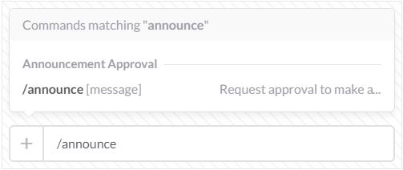
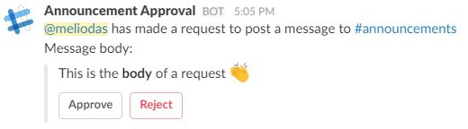
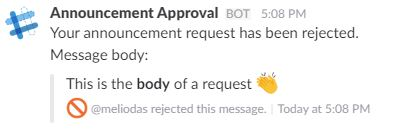

# Announcement Approval for Slack  

This is for teams where posting to the [#general](https://my.slack.com/messages/general/) channel (often renamed to [#announcements](https://my.slack.com/messages/announcements/)) has been restricted to team owners and/or admins. This would allow a user to have a message posted to the #general channel after getting approval from an admin or another private channel.

## Setup

You will be prompted to setup the incoming webhook, this webhook is used to select the channel that approval requests are sent too. Select the channel or user that you want these requests to be sent too.

After the app is added to your team, you will be asked to sign in with Slack.

You will then be sent to the configuration page for your team.

Note: By default, only team admins and owners are allowed to edit the team configuration. Everyone else will be denied access until an admin or team owner logs in and allows everyone access.

## Usage

With no further configuration, the app has been added to your team once its added to the team.

### Making a request

Anyone can make a request to make an announcement using this slash command, `/announce` followed by your message. All MarkDown and emojis will work as normal and will be passed on as if you had posted the announcement yourself.

### Handling a request

In the selected channel to post the requests for approval, a message like this one will be posted. These buttons are interactable and simply clicking `Approve` or `Reject`.

This example was made using `/announce This is the *body* of a request :clap:`

Once the post has been approved or rejected, the prompt will update to record who addressed it and when it was addressed.

### Processed response

If the message was rejected, the individual who make the initial request will get this message to inform them that their announcement won't be made. This message will be a direct message from `@slackbot`

If the message was approved, a post will be made automatically to selected channel. The bot will use the icon and real name of the individual who made the request in the first place. This is to show who wanted to make the announcement.

## Configuration

At the configuration page, these are the available settings that can be changed for your Slack team. To get to the configuration page, you simply need to signin with Slack.

Option | Default Value | Description
:---|:---:|:---:
Post channel | [#general](https://my.slack.com/messages/general/) or it's replacement | The selected channel that is ultimatly trying to be posted too. This has to be a public channel.
Approval channel [1] | The user who added the app to the team | The channel where an post needs approval from. Typically a "Executive Board" kind of channel that is typically private.
Backup channel | The user who added the app to the team | Another option is to divert the post to a less important channel, this is the channel it will be diverted too.
Admin only approval | True | In the channel that the request will be sent to, allow only a team admin to respond. This is for the case where there are both team admins and non-admins in the approval channel.
Admin only login | True | Only an admin can change these settings. This can be disabled, but requires and team admin or owner to login to disable it.

[1] This list is determined by the user who added the app to the team in the first place. If you have a dummy account to just hold authentication tokens, this user would also have to be in the private channel you want to select.
